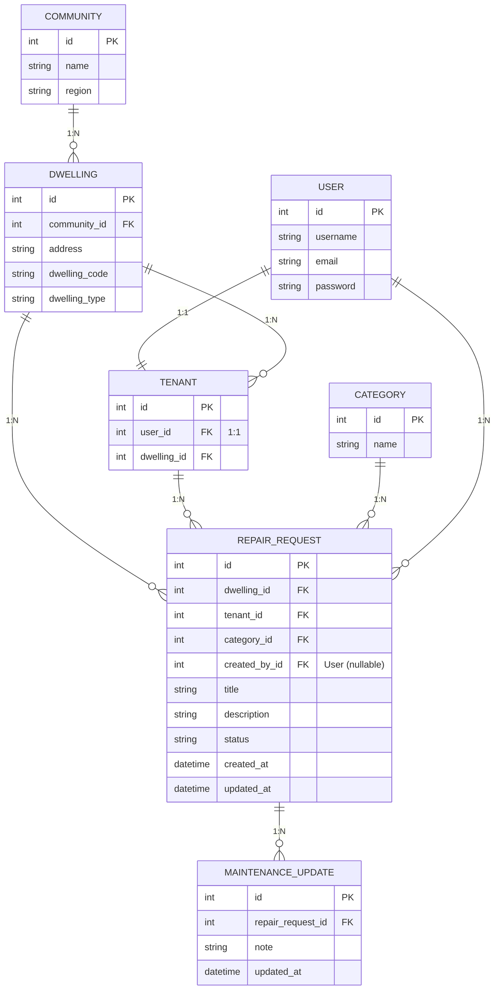

# NT Housing Maintenance System - Entity Relationship Diagram

## ERD Class Diagram by Mermaid tool

## Relationships Summary

| From | To | Type | Description |
|------|-----|------|-------------|
| USER | TENANT | 1:1 | Each user is associated with one tenant profile |
| COMMUNITY | DWELLING | 1:N | A community has many dwellings |
| DWELLING | TENANT | 1:N | A dwelling can have multiple tenants |
| DWELLING | REPAIR_REQUEST | 1:N | A dwelling can have many repair requests |
| TENANT | REPAIR_REQUEST | 1:N | A tenant can submit many repair requests |
| CATEGORY | REPAIR_REQUEST | 1:N | A category can have many repair requests |
| USER | REPAIR_REQUEST | 1:N | A user can create many repair requests (nullable) |
| REPAIR_REQUEST | MAINTENANCE_UPDATE | 1:N | A repair request can have many updates |

## Model Descriptions

### USER
Django built-in User model for authentication.

### COMMUNITY
Represents a remote housing community.

### DWELLING
A residential unit within a community (house, unit, town house, granny flat, room ).

### TENANT
Links a User to a Dwelling (one tenant per user).

### CATEGORY
Categories for repair requests (Electrical, Plumbing, Fittings, Windows and door, Locksmith, Roofing, Walls and Ceilings).

### REPAIR_REQUEST
Main model for tracking repair requests with status tracking (pending, in_progress, completed).

### MAINTENANCE_UPDATE
Tracks updates and notes for each repair request.
